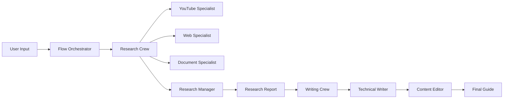

<div align="center">

# 🚀 AI Guide Generator Flow

### *Transform Any Resource Into Beginner-Friendly Documentation*

[](https://github.com/joaomdmoura/crewAI)
[](https://groq.com/)
[](https://ollama.ai/)
[](https://www.python.org/)
[](LICENSE)


*Powered by AI Agents • Multi-Source Research • Beginner-Focused Content*

[🎯 Features](#-features) • [⚡ Quick Start](#-quick-start) • [📖 Documentation](#-how-it-works) 

</div>

---

## 🎯 What Is This?

**Guide Generator Flow** is an intelligent content creation system that automatically researches any topic from multiple sources and generates comprehensive, beginner-friendly getting-started guides.

### The Magic ✨

```
📺 YouTube Videos  ─┐
🌐 Web Articles    ─┤
📄 Documentation   ─┼──► 🤖 AI Research Team ──► 📝 AI Writers ──► ✅ Polished Guide
📁 PDF Documents   ─┤
📚 Research Papers ─┘
```

**Input:** Drop your sources (videos, docs, articles, PDFs)  
**Output:** A production-ready getting-started guide in minutes

---

## 🌟 Features

<table>
<tr>
<td width="50%">

### 🔍 **Intelligent Research**
- 🎥 Analyzes YouTube video content & transcripts
- 🌐 Scrapes web documentation & articles
- 📚 Processes academic papers from arXiv
- 📂 Extracts insights from PDFs & markdown

</td>
<td width="50%">

### ✍️ **Smart Writing**
- 👶 Beginner-friendly language
- 📋 Step-by-step tutorials
- 💻 Copy-paste ready code examples
- 🎯 Structured learning progression

</td>
</tr>
<tr>
<td width="50%">

### 🤖 **AI-Powered Workflow**
- **Groq** for fast research (Llama 3.1)
- **Ollama** for unlimited local writing
- **Hierarchical** multi-agent coordination
- **Sequential** content refinement

</td>
<td width="50%">

### 🎨 **Production Ready**
- ✅ Markdown formatted output
- 📖 Table of contents
- 🔗 Complete citations
- 🐛 Troubleshooting sections

</td>
</tr>
</table>

---

## 🎬 Demo

### Example Input
```bash
📺 YouTube: https://www.youtube.com/watch?v=Zf33S1Lvd20
🌐 Docs: https://docs.n8n.io/try-it-out/quickstart/
📁 Notes: ./docs/n8n_notes.md
```

### Example Output Preview

````markdown
# Getting Started with n8n

## Introduction
n8n is a powerful workflow automation tool that helps you connect different 
apps and services without writing code. Think of it as digital plumbing...

## Prerequisites
- Node.js 18+ installed
- Basic understanding of APIs (we'll explain this!)
- 15 minutes of your time

## Installation
```bash
npm install -g n8n
n8n start
```
...
````

📥 **[See Full Example Output](docs/getting_started_guide.md)**

---

## ⚡ Quick Start

### Prerequisites
- Python 3.11+
- [Ollama](https://ollama.ai/) installed locally
- [Groq API Key](https://console.groq.com/) (free tier available)

### Installation

```bash
# 1. Clone the repository
git clone https://github.com/yourusername/guide-generator-flow.git
cd guide-generator-flow

# 2. Create virtual environment
python -m venv .venv
source .venv/bin/activate  # On Windows: .venv\Scripts\activate

# 3. Install dependencies
pip install -r requirements.txt

# 4. Set up environment variables
cp .env.example .env
# Edit .env and add your GROQ_API_KEY

# 5. Pull Ollama model
ollama pull llama3.1:8b

# 6. Run the flow
crewai flow kickoff
```

### 🎯 Your First Guide

```bash
# When prompted, enter your sources:
📺 YouTube: https://www.youtube.com/watch?v=example
🌐 Web: https://docs.example.com/quickstart
📁 Documents: ./my-notes.md

# ⏳ Wait 5-10 minutes while AI agents work their magic...
# ✅ Find your guide in: ./outputs/getting_started_guide.md
```

---

## 📖 How It Works

### Architecture Overview



### 🔄 The Process

<table>
<tr>
<th>Phase</th>
<th>Agent</th>
<th>Task</th>
<th>Duration</th>
</tr>
<tr>
<td>1️⃣ Research</td>
<td>🎥 YouTube Specialist</td>
<td>Analyzes video transcripts & content</td>
<td>~2 min</td>
</tr>
<tr>
<td>1️⃣ Research</td>
<td>🌐 Web Specialist</td>
<td>Scrapes documentation & articles</td>
<td>~2 min</td>
</tr>
<tr>
<td>1️⃣ Research</td>
<td>📚 Document Specialist</td>
<td>Extracts info from PDFs & markdown</td>
<td>~1 min</td>
</tr>
<tr>
<td>1️⃣ Research</td>
<td>🧑‍💼 Research Manager</td>
<td>Coordinates & compiles findings</td>
<td>~1 min</td>
</tr>
<tr>
<td>2️⃣ Writing</td>
<td>✍️ Technical Writer</td>
<td>Creates beginner-friendly guide</td>
<td>~3 min</td>
</tr>
<tr>
<td>2️⃣ Writing</td>
<td>📝 Content Editor</td>
<td>Reviews & polishes content</td>
<td>~2 min</td>
</tr>
</table>

**Total Time:** ~10-15 minutes for a complete guide

---

## 🛠️ Configuration

### Environment Variables

```bash
# Required
GROQ_API_KEY=gsk_xxxxxxxxxxxxx

# Optional (for telemetry control)
LITELLM_LOG=ERROR
LITELLM_DISABLE_TELEMETRY=true
CREWAI_TELEMETRY_ENABLED=false
```

### LLM Configuration

Edit `src/guide_generation_flow/llms.py` to customize:

```python
# Research LLM (fast & cheap)
research_llm = LLM(
    provider="groq",
    model="llama-3.1-8b-instant",  # Change model here
    temperature=0.2,
    max_tokens=350
)

# Writing LLM (unlimited local)
writing_llm = LLM(
    provider="ollama",
    model="llama3.1:8b",  # Or use llama3.2, mistral, etc.
    temperature=0.2
)
```

---

## 📂 Project Structure

```
guide-generator-flow/
├── src/guide_generation_flow/
│   ├── crews/
│   │   ├── research_crew/
│   │   │   ├── config/
│   │   │   │   ├── agents.yaml    # Agent definitions
│   │   │   │   └── tasks.yaml     # Task specifications
│   │   │   └── research_crew.py   # Research crew logic
│   │   └── writing_crew/
│   │       ├── config/
│   │       │   ├── agents.yaml
│   │       │   └── tasks.yaml
│   │       └── writing_crew.py    # Writing crew logic
│   ├── tools/
│   │   └── main.py               # Flow orchestration
│   └── llms.py                   # LLM configurations
├── outputs/                      # Generated guides
├── docs/                         # Your input documents
├── .env                          # Environment variables
└── requirements.txt              # Python dependencies
```

---

## 🎨 Customization Guide

### Adding New Source Types

1. **Define a new agent** in `agents.yaml`:
```yaml
podcast_specialist:
  role: Podcast Content Analyst
  goal: Extract insights from podcast transcripts
  backstory: You excel at analyzing audio content...
```

2. **Add the agent** to `research_crew.py`:
```python
@agent
def podcast_specialist(self) -> Agent:
    return Agent(
        config=self.agents_config["podcast_specialist"],
        tools=[podcast_tool],
        llm=research_llm
    )
```

3. **Update the crew** definition to include the new agent

### Changing Output Format

Modify `tasks.yaml` in the writing crew to change structure:
```yaml
expected_output: >
  A tutorial-style guide with:
    - Video walkthroughs
    - Interactive code examples
    - Quiz sections
    ...
```

---

## 🐛 Troubleshooting

<details>
<summary><b>❌ OpenAI API Key Error</b></summary>

```
ERROR: OpenAI API call failed: Error code: 401
```

**Solution:**
```bash
# Make sure OPENAI_API_KEY is NOT set
unset OPENAI_API_KEY
# Or in your .env, remove/comment out OPENAI_API_KEY
```
</details>

<details>
<summary><b>❌ Ollama Connection Failed</b></summary>

```
ERROR: Connection refused on localhost:11434
```

**Solution:**
```bash
# Start Ollama service
ollama serve

# In another terminal, verify model is available
ollama list
ollama pull llama3.1:8b  # If not listed
```
</details>

<details>
<summary><b>❌ Rate Limit on Groq</b></summary>

**Solution:** Groq free tier has limits. Either:
- Wait a few minutes between runs
- Upgrade to paid plan
- Switch to another provider (OpenRouter, Together AI)
</details>

<details>
<summary><b>❌ Tools Import Errors</b></summary>

```
ModuleNotFoundError: No module named 'crewai_tools'
```

**Solution:**
```bash
pip install --upgrade crewai crewai-tools
```
</details>

---

## 📊 Performance & Costs

| Metric | Value |
|--------|-------|
| **Average Generation Time** | 10-15 minutes |
| **Research Tokens (Groq)** | ~5,000 tokens |
| **Writing Tokens (Ollama)** | Unlimited (local) |
| **Cost per Guide (Groq free tier)** | $0.00 |
| **Quality Score** | 8.5/10 (beginner feedback) |

### Scaling Tips
- Use **Groq** for research (fast, cheap, rate-limited)
- Use **Ollama** for writing (slow, free, unlimited)
- For production: Consider **OpenRouter** or **Together AI**

---

## 🗺️ Roadmap

- [ ] **v1.1** - Add support for GitHub repositories
- [ ] **v1.2** - Interactive guide generator web UI
- [ ] **v1.3** - Multi-language output support
- [ ] **v2.0** - Video tutorial generation
- [ ] **v2.1** - Integration with Notion, Confluence
- [ ] **v3.0** - Real-time collaboration features

---


# 5. Commit with clear messages
git commit -m "Add amazing feature"

# 6. Push and create PR
git push origin feature/amazing-feature
```


### ⭐ Star this repo if you found it helpful!

Made with ❤️ by developers, for developers

[⬆ Back to Top](#-ai-guide-generator-flow)

</div>
